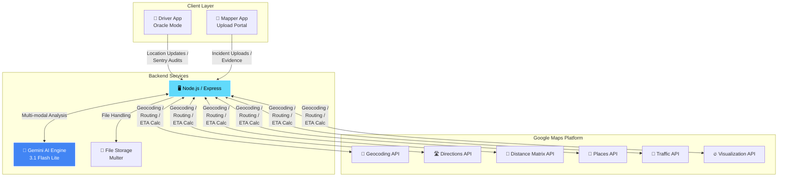

<p align="center">
  
  
  
  
  
  
</p>

<h1 align="center">🛡️ Safety Map Africa</h1>
<p align="center">
  <strong>Decentralized Situational Awareness Network for Urban Safety</strong><br/>
  <em>Transforming Citizens into Sentry Nodes through AI-Powered Collective Intelligence</em>
</p>

<p align="center">
  <a href="#-quick-start">Quick Start</a> •
  <a href="#-features">Features</a> •
  <a href="#-architecture">Architecture</a> •
  <a href="#-ai-integration">AI Integration</a> •
  <a href="#-api-reference">API</a>
</p>

---

## 🎯 Mission

In rapidly growing urban environments across Africa, traditional security infrastructure is often sparse or reactive. **Safety Map Africa** provides a **proactive, community-driven alternative** that democratizes urban safety data through:

- 🔮 **Predictive Intelligence** — AI identifies behavioral precursors to incidents before they escalate
- 👥 **Community Empowerment** — Residents actively participate in their own security
- 🎖️ **Verified Truth** — Forensic auditing combats misinformation and deepfakes
- 💎 **Tokenized Incentives** — Rewards for high-fidelity, verified data contributions (RGT)

> *"Every citizen with a smartphone becomes a sentinel in the safety grid."*

---

## ✨ Core Features

### 🚗 Driver Portal — "Oracle Mode"
Transforms mobile devices into tactical sensors for real-time threat detection.

| Capability | Description |
|------------|-------------|
| **Multi-Modal Analysis** | Continuous 3-second video/audio buffer auditing |
| **Weapon Detection** | Identifies firearms, knives, and other threats |
| **Behavioral Analysis** | Detects erratic driving and crowd anomalies |
| **Predictive Vectors** | 15-30 second escalation probability forecasts |
| **Live Navigation** | Turn-by-turn routing with traffic integration |

### 📤 Forensic Upload Portal
Secure evidence submission with AI-powered verification.

- **6-Point Verification:** Pixel integrity, metadata consistency, contextual landmarks
- **Deepfake Detection:** Synthetic content identification
- **Intelligence Summaries:** Tactical event reports for rapid assessment
- **Multi-Format Support:** Video (MP4), Audio (WAV), Images (JPEG/PNG)

### 🗺️ Live Command Map (MapView)
Real-time situational awareness dashboard.

- **15-Second Tracking:** Live Mapper Node positions
- **ETA & Routing:** Dynamic travel time calculations
- **Heatmap Visualization:** Risk zone identification
- **Situational HUD:** Alert auditing and forensic report access

### 💰 RGT Token Yield
Proof-of-Perspective incentive system.

- Earn tokens based on data quality, rarity, and verification score
- Trust rank multipliers (Oracle → Elite → Sentinel)
- Consistent, high-fidelity reporting rewards

---

## 🚀 Quick Start

### Prerequisites
- Node.js 18+
- Google Gemini API Key ([Get one free](https://ai.google.dev/))
- Google Maps Platform API Key ([Get one here](https://developers.google.com/maps/documentation/javascript/get-api-key))

### Installation

```bash
# Clone the repository
git clone https://github.com/nubianking/SafetyMap-Test.git
cd SafetyMap-Test

# Install dependencies
npm install

# Configure environment
cp .env.example .env

# Edit .env and add your API keys:
# VITE_GEMINI_API_KEY=your_gemini_api_key
# VITE_GOOGLE_MAPS_API_KEY=your_maps_api_key

# Start development server
npm run dev
```

Open [http://localhost:5173](http://localhost:5173) to access the application.

---

## 🏗️ Architecture



### Tech Stack

| Layer | Technology | Purpose |
|-------|------------|---------|
| **Frontend** | React 19 + TypeScript + Vite | Modern, type-safe UI framework |
| **Styling** | Tailwind CSS | Custom tactical/dark-themed design |
| **AI Engine** | Google Gemini 3.1 Flash Lite | Multi-modal video/audio analysis |
| **Mapping** | Google Maps JavaScript API | Interactive maps with traffic & heatmaps |
| **Backend** | Node.js + Express | REST API & file handling |
| **Icons** | Lucide React | Consistent iconography |

---

## 🧠 AI Integration

Safety Map Africa leverages **Gemini 3.1 Flash Lite Preview** for sophisticated multi-modal reasoning:

### 1. Real-Time Sentry Audits
Captures 3-second video/audio buffers and prompts Gemini to act as a **"Predictive Tactical Forensic AI"**.

**Returns structured JSON with:**
- Detected hazards (weapons, fire, collisions)
- Acoustic events (gunshots, screams, explosions)
- Behavioral anomalies (crowd aggression, erratic movement)
- Predictive risk probabilities (0-100%)

### 2. Forensic Evidence Verification
Analyzes uploaded media for authenticity and severity classification.

**6-Point Verification Pipeline:**
1. ✅ Pixel integrity analysis
2. ✅ Metadata consistency check
3. ✅ Deepfake probability score
4. ✅ Contextual landmark validation
5. ✅ Temporal sequence verification
6. ✅ Severity classification (Low/Medium/High/Critical)

---

## 📡 Incident Upload Configuration

### Video Reporting
| Spec | Value |
|------|-------|
| Format | MP4 (H.264) |
| Duration | 3s min — 20s max |
| Resolution | 720p preferred / 1080p max |
| Max Size | 50 MB |
| Endpoint | `POST /api/incidents/upload` |

### Audio Reporting
| Spec | Value |
|------|-------|
| Format | WAV (PCM) |
| Duration | 2s min — 15s max |
| Sample Rate | 16,000 Hz (Mono) |
| Max Size | 10 MB |

### Image Reporting
| Spec | Value |
|------|-------|
| Format | JPEG / PNG |
| Max Images | 3 per report |
| Max Size | 10 MB per image |
| Resolution | 1280×720 recommended |

### Core Metadata Schema
```json
{
  "report_type": "video|audio|image",
  "incident_category": "string",
  "node_id": "string",
  "device_id": "string",
  "timestamp": "ISO8601",
  "location": { "lat": number, "lng": number },
  "heading": number,
  "speed": number
}
```

---

## 🔌 API Reference

### Mapper Profile Endpoints

| Method | Endpoint | Description |
|--------|----------|-------------|
| `GET` | `/api/mappers` | List all registered mappers (no passkeys) |
| `POST` | `/api/mappers` | Create new mapper profile & generate passkey |
| `POST` | `/api/mappers/login` | Authenticate with `alias` + `passkey` |

### Incident Endpoints

| Method | Endpoint | Description |
|--------|----------|-------------|
| `POST` | `/api/incidents/upload` | Upload video/audio/image evidence |
| `GET` | `/api/incidents` | List all reported incidents |
| `GET` | `/api/incidents/:id` | Get specific incident details |

### AI Analysis Endpoints

| Method | Endpoint | Description |
|--------|----------|-------------|
| `POST` | `/api/ai/sentry-audit` | Real-time video/audio buffer analysis |
| `POST` | `/api/ai/verify-evidence` | Forensic verification of uploaded media |

> **Note:** Mapper data is currently stored in memory. Replace with persistent database (PostgreSQL/MongoDB) for production deployment.

---

## 🔒 Environment Variables

| Variable | Description | Required |
|----------|-------------|----------|
| `VITE_GEMINI_API_KEY` | Google Gemini API for AI analysis | ✅ Yes |
| `VITE_GOOGLE_MAPS_API_KEY` | Google Maps Platform access | ✅ Yes |
| `PORT` | Server port (default: 3000) | ❌ Optional |

---

## 🗺️ Roadmap

- [x] **v1.0** Core Driver Portal with Oracle Mode
- [x] **v1.1** Forensic Upload Portal
- [x] **v1.2** Live Command Map with heatmaps
- [x] **v1.3** Google Maps integration (Traffic, Routing)
- [ ] **v2.0** RGT Token Smart Contract Integration
- [ ] **v2.1** Offline-First PWA Support
- [ ] **v2.2** Community Verification (crowd-sourced fact-checking)
- [ ] **v3.0** Multi-City Grid Deployment
- [ ] **v3.1** Integration with Emergency Services APIs

---

## 🤝 Contributing

We welcome contributions from developers, security professionals, and urban planners!

1. **Fork** the repository
2. **Create** a feature branch (`git checkout -b feature/amazing-feature`)
3. **Commit** your changes (`git commit -m 'Add amazing feature'`)
4. **Push** to the branch (`git push origin feature/amazing-feature`)
5. **Open** a Pull Request

**Priority Areas:**
- Additional AI detection models (vehicle accidents, infrastructure damage)
- Enhanced deepfake detection algorithms
- Mobile app optimization (React Native/Flutter)
- Blockchain integration for RGT tokenization

---

## ⚠️ Important Notes

**API Key Security:** Never commit your `.env` file. Restrict your Google Maps API key to your domain in the Google Cloud Console.

**Data Privacy:** Location and media data is processed for safety analysis. Implement GDPR-compliant data handling for production deployments.

**Performance:** Large video files (>50MB) may cause upload delays. Consider implementing chunked uploads for production.

---

## 👥 Team

| Name | Role | Contact |
|------|------|---------|
| **Otemade Balogun** | Founder & Lead Developer | balogun.otemade@gmail.com |

---

## 📄 License

Proprietary / Confidential — All rights reserved.

---

<p align="center">
  Built with 💙 by <strong>OBA Inc</strong> for safer African cities.
  <br/>
  <sub>Powered by Google Gemini & Google Maps Platform</sub>
</p>
